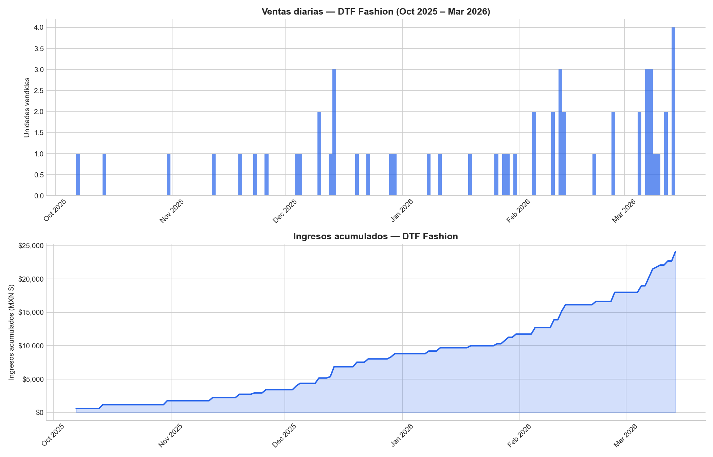
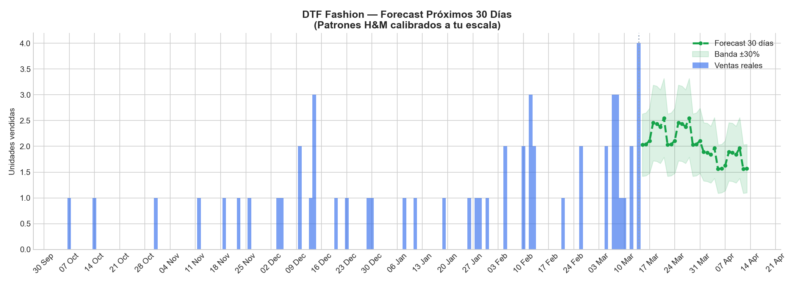
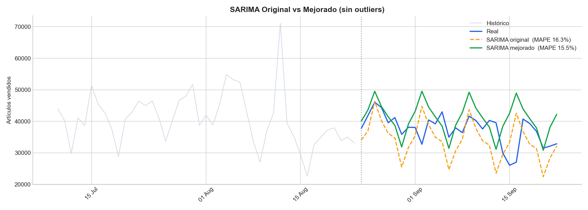
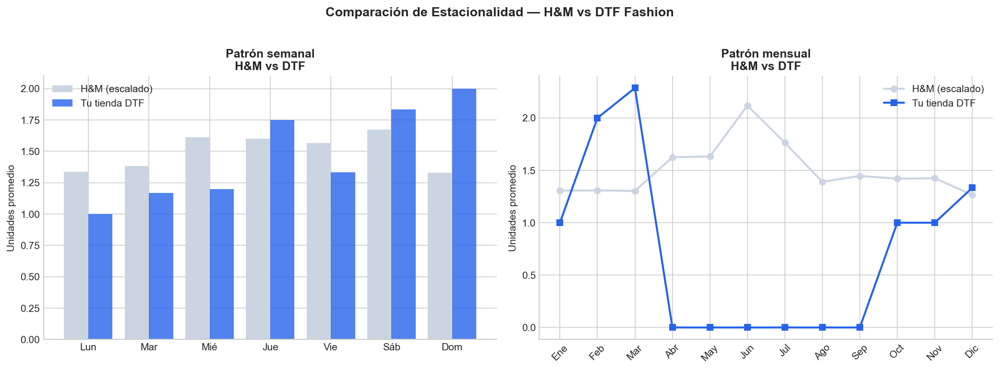

# 🧵 DTF Fashion — Sales Forecasting Pipeline

<div align="center">


**A production-grade demand forecasting pipeline for a DTF (Direct-to-Film) fashion store,**  
**built by transferring seasonal patterns from H&M's 31.7M-transaction dataset.**

[📄 Technical Report (PDF)](#-final-resources) · [📊 View Results](#-model-results) · [🚀 Quick Start](#-installation)

</div>

---

## 📸 Project Overview

<div align="center">

| Historical Sales | 30-Day Forecast |
|:---:|:---:|
|  |  |

</div>

> **The core challenge:** DTF Fashion had only 54 real sales records. Training SARIMA directly on 54 points causes severe overfitting. The solution: extract macro seasonal patterns from H&M (31.7M transactions), scale them to DTF's real volume, and correct month-by-month with actual store data.

---

## 🏗️ Pipeline Architecture

```
📦 H&M Dataset (31.7M rows, 3.5 GB)
        │
        ▼
🔧 Optimized Loading (855 MB RAM via dtype tuning)
        │
        ▼
📊 Daily Aggregation → 731-day time series
        │
        ▼
🔍 Outlier Detection (IQR ×2.5) → 26 anomalous days removed
        │
        ▼
📈 SARIMA(1,1,1)(1,1,1)[7] Training → MAPE: 15.48%
        │
        ▼
⚖️  Seasonal Index Extraction (weekly + monthly)
        │
        ▼
🎯 Scale Transfer → DTF Fashion volume (1.50 units/day avg)
        │
        ▼
🔮 30-Day Forecast with ±30% confidence band
```

---

## 📊 Model Results

### Iteration History — What Worked and What Didn't

| Iteration | Model | MAPE | Decision |
|-----------|-------|------|----------|
| 1 | SARIMA(1,1,1)(1,1,1)[7] — raw data | 16.27% | ⚠️ Baseline — unstable CI |
| 2 | SARIMA + XGBoost hybrid | 23.43% | ❌ Discarded — amplified outliers |
| 3 | **SARIMA — cleaned series** | **15.48%** | ✅ **Final model** |

> XGBoost was tested as a residual corrector with 13 features (day-of-week, lags, quarter, weekend flag). It worsened MAPE by 7+ points because it over-fit to the weekend pattern (`es_finde` feature importance: 0.20) and amplified a spike at the start of the test period.

### SARIMA Final Evaluation

| Metric | Value |
|--------|-------|
| Model | SARIMA(1,1,1)(1,1,1)[7] |
| Training set | 701 days (cleaned) |
| Test set | 30 days |
| MAE | 5,163 units/day |
| MAPE | **15.48%** |
| Outliers corrected | 26 days |


*SARIMA original (orange) vs improved (green) on 30-day test set*

### Seasonal Pattern Comparison — H&M vs DTF Fashion



Key finding: DTF Fashion peaks on **Sundays** (online buyers), while H&M peaks on **Saturdays** (in-store traffic). Monthly correction factors reveal DTF outperforms H&M's scaled prediction by **75% in March** and **53% in February**.

### DTF Fashion Financial Summary

| Indicator | Value |
|-----------|-------|
| Analysis period | Oct 2025 – Mar 2026 |
| Total transactions | 54 units |
| Gross revenue | $24,092.00 MXN |
| Net revenue | $19,623.48 MXN |
| Net margin | 81.5% |
| Average ticket | $446.15 MXN |
| Top category | Sports (25.9%) |
| Top product | T-Shirt (68.5%) |
| **30-day forecast** | **61 units (range: 43–80)** |

---

## 🚀 Installation

### Requirements

- Python 3.10+
- ~1.5 GB RAM available
- H&M dataset CSV files (download from [Kaggle](https://www.kaggle.com/competitions/h-and-m-personalized-fashion-recommendations/data))

### Step 1 — Clone the repository

```bash
git clone https://github.com/FlowersLoop/dtf-fashion-forecasting.git
cd dtf-fashion-forecasting
```

### Step 2 — Install dependencies

```bash
pip install pandas numpy matplotlib seaborn statsmodels xgboost scikit-learn reportlab openpyxl pmdarima
```

### Step 3 — Add the H&M raw files

Download from Kaggle and place in `data/raw/`:

```
data/raw/
├── transactions_train.csv   (~3.5 GB)
├── articles.csv
└── customers.csv
```

### Step 4 — Run the full pipeline

```bash
# 1. Clean and aggregate H&M data
python src/hm_limpieza_agregacion.py

# 2. Exploratory analysis
python src/hm_exploracion.py

# 3. Train SARIMA (improved version)
python src/hm_sarima_mejorado.py

# 4. Fine-tune to DTF Fashion scale
python src/dtf_finetuning.py

# 5. Generate the PDF technical report
python src/dtf_reporte_pdf.py
```

> ⏱️ Steps 1 and 3 take 5–15 minutes each due to the size of the H&M dataset.

---

## 📁 Project Structure

```
dtf-fashion-forecasting/
│
├── data/
│   ├── raw/                          # H&M CSVs (not tracked by git)
│   │   └── DTF_s_DATA_CORRECT.xlsx   # Real store data
│   └── processed/                    # Outputs: CSVs, PNGs, PDF report
│
├── src/
│   ├── hm_limpieza_agregacion.py     # H&M loading & cleaning pipeline
│   ├── hm_exploracion.py             # Exploratory analysis & visualizations
│   ├── hm_sarima.py                  # SARIMA baseline (iteration 1)
│   ├── hm_xgboost.py                 # Hybrid SARIMA+XGBoost (discarded)
│   ├── hm_sarima_mejorado.py         # SARIMA with outlier cleaning (final)
│   ├── dtf_finetuning.py             # Fine-tuning & DTF forecast
│   └── dtf_reporte_pdf.py            # PDF report generator
│
└── README.md
```

---

## 📄 Final Resources

| Resource | Description |
|----------|-------------|
| [📊 DTF Forecast CSV](data/processed/dtf_forecast_30dias.csv) | 30-day forecast with confidence bands |
| [📈 H&M Aggregated Series](data/processed/hm_ventas_agregadas.csv) | Daily sales series (731 days) |
| [📋 Top Categories](data/processed/hm_top_categorias.csv) | Top 5 H&M categories by volume |
| [📄 Technical Report PDF](data/processed/DTF_Fashion_Reporte_Tecnico_Final.pdf) | Full bilingual technical report |

---

## 🛠️ Tech Stack

| Tool | Purpose |
|------|---------|
| `pandas` | Data loading, aggregation, dtype optimization |
| `statsmodels` | SARIMA model training and evaluation |
| `xgboost` | Hybrid model experiment (discarded) |
| `scikit-learn` | MAE/RMSE/MAPE evaluation metrics |
| `matplotlib` / `seaborn` | All visualizations |
| `reportlab` | PDF report generation with Unicode support |
| `openpyxl` | DTF Fashion Excel file parsing |

---

---
---

# 🧵 DTF Fashion — Pipeline de Pronóstico de Ventas

<div align="center">

**Pipeline de pronóstico de demanda para una tienda de impresión DTF,**  
**construido transfiriendo patrones estacionales del dataset de H&M con 31.7 millones de transacciones.**

</div>

---

## 📸 Descripción del Proyecto

> **El reto central:** DTF Fashion contaba con solo 54 registros de ventas reales. Entrenar SARIMA directamente sobre 54 puntos genera overfitting severo. La solución: extraer patrones estacionales macro de H&M (31.7M transacciones), escalarlos al volumen real de DTF y corregirlos mes a mes con datos reales de la tienda.

---

## 📊 Resultados del Modelo

### Historial de Iteraciones — Qué Funcionó y Qué No

| Iteración | Modelo | MAPE | Decisión |
|-----------|--------|------|----------|
| 1 | SARIMA(1,1,1)(1,1,1)[7] — datos crudos | 16.27% | ⚠️ Línea base — IC inestable |
| 2 | SARIMA + XGBoost híbrido | 23.43% | ❌ Descartado — amplificó outliers |
| 3 | **SARIMA — serie limpia** | **15.48%** | ✅ **Modelo final** |

> XGBoost se probó como corrector de residuos con 13 features. Empeoró el MAPE en más de 7 puntos porque sobreajustó al patrón de fin de semana y amplificó un día atípico al inicio del período de prueba.

### Resumen Financiero DTF Fashion

| Indicador | Valor |
|-----------|-------|
| Período analizado | Oct 2025 – Mar 2026 |
| Total de transacciones | 54 unidades |
| Ingresos brutos | $24,092.00 MXN |
| Ingreso neto | $19,623.48 MXN |
| Margen neto | 81.5% |
| Ticket promedio | $446.15 MXN |
| Categoría líder | Sports (25.9%) |
| Prenda líder | T-Shirt (68.5%) |
| **Pronóstico 30 días** | **61 unidades (rango: 43–80)** |

---

## 🚀 Instalación

### Paso 1 — Clona el repositorio

```bash
git clone https://github.com/FlowersLoop/dtf-fashion-forecasting.git
cd dtf-fashion-forecasting
```

### Paso 2 — Instala las dependencias

```bash
pip install pandas numpy matplotlib seaborn statsmodels xgboost scikit-learn reportlab openpyxl pmdarima
```

### Paso 3 — Agrega los archivos CSV de H&M

Descárgalos desde [Kaggle](https://www.kaggle.com/competitions/h-and-m-personalized-fashion-recommendations/data) y colócalos en `data/raw/`.

### Paso 4 — Ejecuta el pipeline completo

```bash
python src/hm_limpieza_agregacion.py   # Limpieza y agregación H&M
python src/hm_exploracion.py           # Análisis exploratorio
python src/hm_sarima_mejorado.py       # Entrenamiento SARIMA mejorado
python src/dtf_finetuning.py           # Fine-tuning a escala DTF
python src/dtf_reporte_pdf.py          # Reporte técnico en PDF
```

---

## 📄 Recursos Finales

| Recurso | Descripción |
|---------|-------------|
| [📊 Pronóstico DTF CSV](data/processed/dtf_forecast_30dias.csv) | Pronóstico 30 días con bandas de confianza |
| [📈 Serie H&M Agregada](data/processed/hm_ventas_agregadas.csv) | Serie diaria H&M (731 días) |
| [📄 Reporte Técnico PDF](data/processed/DTF_Fashion_Reporte_Tecnico_Final.pdf) | Reporte técnico completo bilingüe |

---

<div align="center">

Made with 🧵 by [FlowersLoop](https://github.com/FlowersLoop)

</div>
